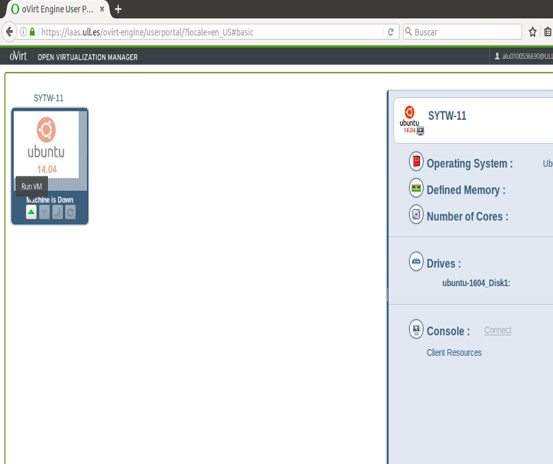
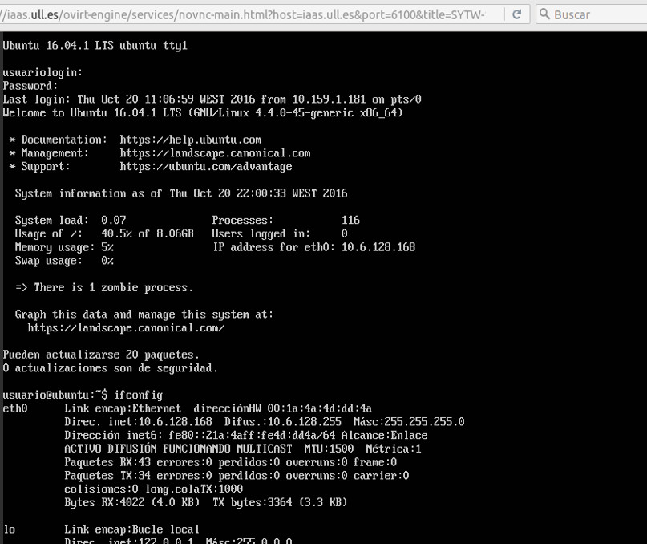

# Práctica 4: Despliegue en iaas

# Objetivo:
*El objetivo de esta práctica es extender el package NodeJS publicado en npm en una práctica anterior con una nueva*
*funcionalidad que permita que los usuarios realizar un despliegue automatico en el servidor de IAAS*

##Pasos para el despliegue en iaas :

* *Para configurar nuestro servidor en iaas debemos acceder a :* [https://iaas.ull.es](https://iaas.ull.es) 
*y loguearnos con nuestro ALU.*

 
 
* *Una vez dentro, iniciamos la maquina haciendo clic en el triangulo verde y una vez iniciada la maquina virtual* 
  *pulsamos Connect*

 

* *La primera vez que iniciamos la maquina, debemos acceder con el nombre: usuario y la contraseña: usuario (Luego debemos*
  *cambiar nuestra contraseña).*
  *Escribimos el comando :*
 ~~~
     ifconfig
 ~~~
 *para obtener la dirreccion IP de nuestra maquina que será la misma durante todo el curso (en nuestro caso:*
 *Direct,inet:10.6.128.168)*

 

* *El útimo paso es conectarnos al iaas mediante ssh, para ello escribimos:* 
 
 ~~~
     ssh usuario@IP
 ~~~

 *(En nuestro caso : ssh@usuario10.6.128.168)*
 
 
## Enlaces :

 **Enlace al campus virtual**

 * [Enunciado](https://casianorodriguezleon.gitbooks.io/ull-esit-1617/content/practicas/practicaplugin.html)

 **Repositorio GitHuB donde se realizó la práctica**

 * [Organización](https://github.com/ULL-ESIT-SYTW-1617/nueva-funcionalidad-para-el-paquete-npm-plugins-merquililycony/)

 **Enlace a Gh-pages**

 * [gh-pages](https://ull-esit-sytw-1617.github.io/nueva-funcionalidad-para-el-paquete-npm-plugins-merquililycony/)

 * [npm](https://www.npmjs.com/package/sytw1617-merquililycony)

 **Página de los autores**

 * [Constanza](http://alu0100673647.github.io)
 * [Merquis](http://merquis.github.io)
 * [Liliana](https://alu0100762846.github.io)

